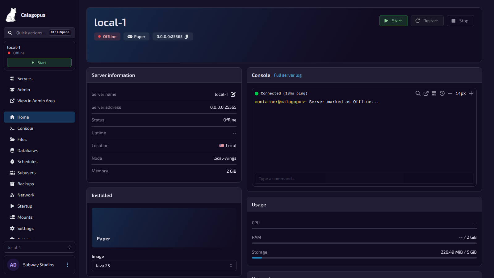
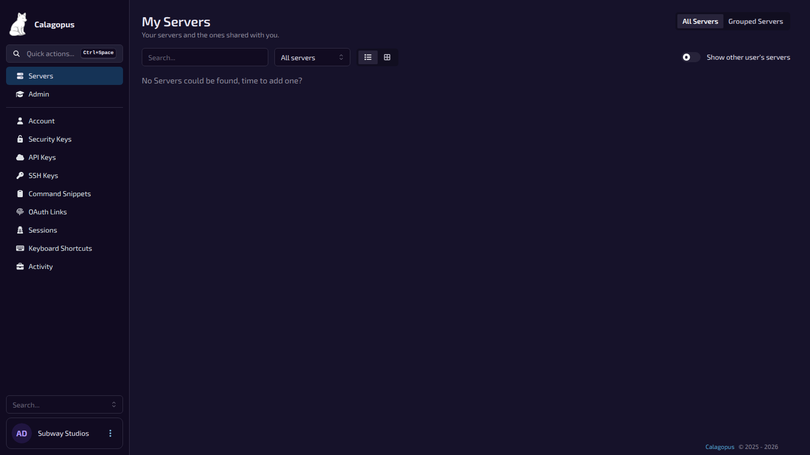
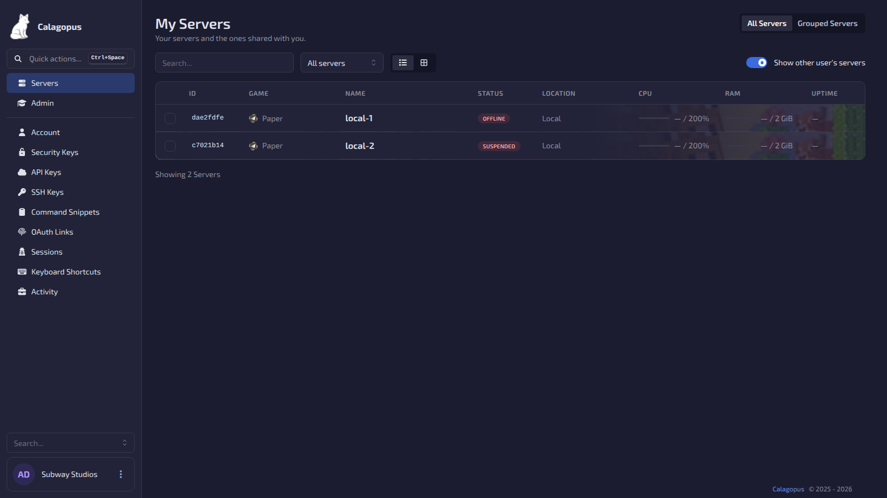
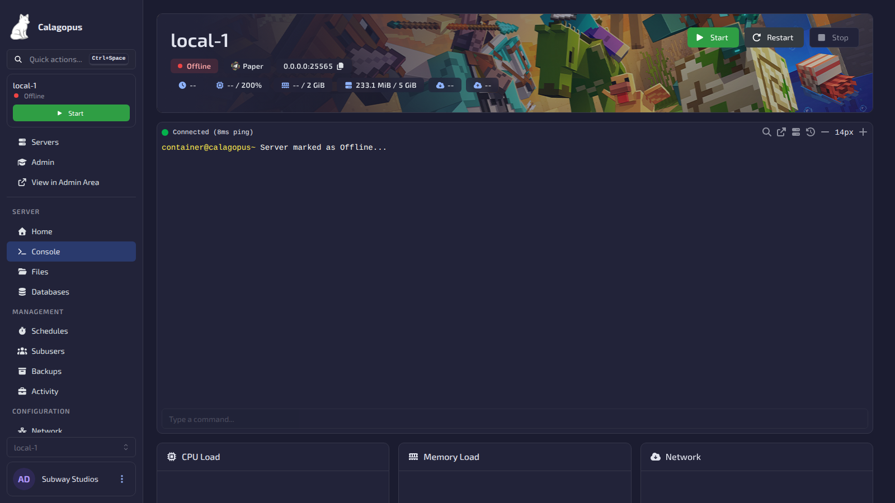
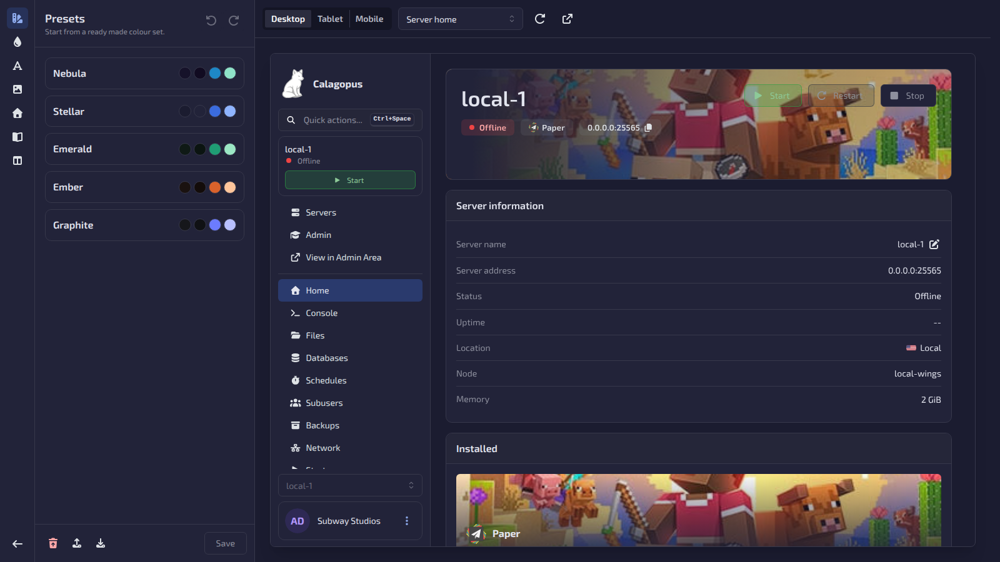

# Fox Theme for Calagopus

A dark theme for [Calagopus Panel](https://calagopus.com) with a live, built-in theme editor.

## Features

- **Server list**: a table with game, status, location, CPU, RAM and uptime, or a grid of cards with
  each game's banner and icon. Search and a status filter included.
- **Server home**: a new landing page with a banner header, power controls, server info, image switcher,
  console preview, usage and network. Admins choose which cards show and in what order.
- **Console**: the banner with live stats on top, a full width terminal, then the charts.
- **Account page**: a profile header with a banner each user uploads themselves. Click the avatar to
  change it.
- **Sidebar**: optional collapsible sections, named from each egg's own menu dividers.
- **Theme editor**: a full screen editor with a live preview of the real panel. Presets, the full colour
  palette, fonts, corner radius, button styles, background image, per game artwork, getting started
  links and the home layout. Undo, redo, import and export.

## Screenshots

| Server list | Grid view |
| --- | --- |
|  |  |

| Console | Theme editor |
| --- | --- |
|  |  |

## Installation

> [!NOTE]
> Requires Calagopus Panel **1.2.0** or newer.

1. Download `dev_s4way_nebula.c7s.zip` from the [latest release](https://github.com/wrrfsub/Fox-Theme-For-Calagopus/releases/latest).
2. In the panel, open **Admin → Extensions** and install the file.
3. Restart the panel.

The extension is listed as **Nebula Theme** (`dev.s4way.nebula`), the project's original name.

## Usage

Open **Admin → Theme Editor**. Every change previews live, and **Save** applies it for all users,
including on the login page.

The theme changes the panel at runtime and never overrides core files, so disabling the extension
brings back the stock panel.

## Contributing

[AGENTS.md](AGENTS.md) explains how the theme is built, how it hooks into the panel and how to test a
change. It is written for people and AI assistants alike.

## Notes

Built with Claude Code. Provided as is, with no promise of updates.

## License

Code is [MIT](LICENSE). The bundled fonts (Exo 2, Montserrat) are under the SIL Open Font License 1.1;
their licence texts are in [`frontend/src/fonts`](frontend/src/fonts).
